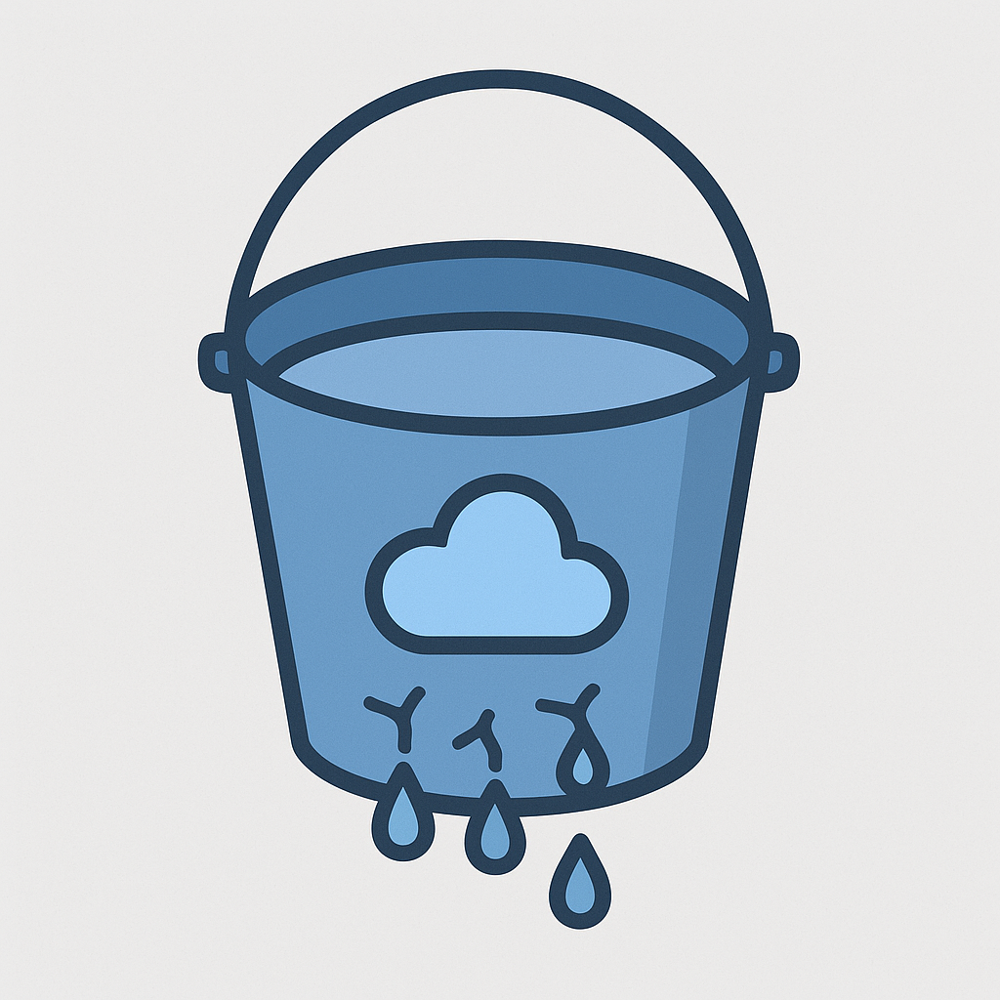
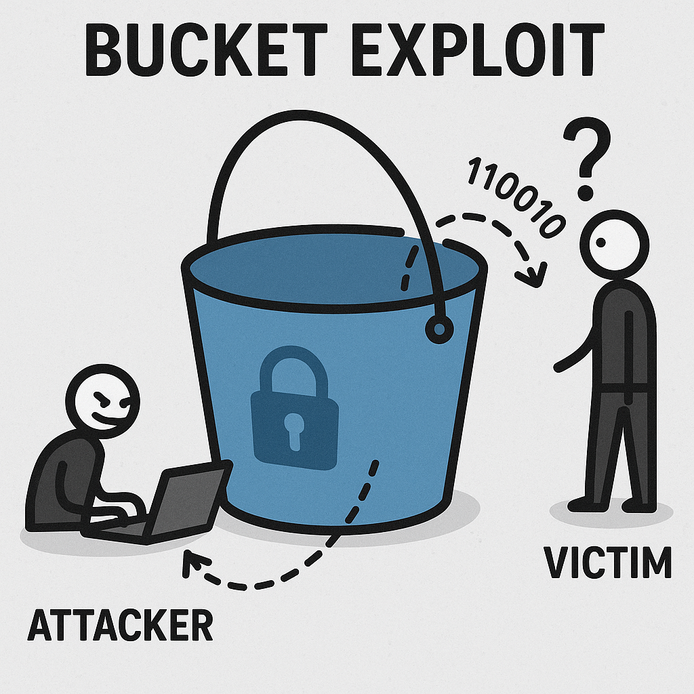

# How a Public-Facing Bucket Led to One of the Largest Mobile App Data Leaks — and How to Prevent It

*Posted on August 29, 2025 by APK Leak Scanner Team*  

---

  

> **TL;DR:** A single misconfigured Firebase bucket in a popular tea delivery app exposed thousands of users' private details to the public internet. Within days, malicious actors exploited the data to doxx victims across social platforms.  
>  
> Our **APK Leak Scanner** was built to prevent exactly this kind of disaster.

---

## ☕ The Tea App Leak: What Went Wrong?

Earlier this year, security researchers discovered that a **tea delivery app**, downloaded by millions of users, had left its **Firebase storage bucket wide open**.  

That meant:  

- No authentication was required  
- Anyone with a browser could list files  
- Sensitive data (phone numbers, order history, even GPS delivery routes) was sitting publicly on the internet  

  

Once attackers noticed, the exploitation was swift:  

- The bucket was scraped using automated tools  
- Personal details were aggregated  
- Thousands of innocent users were **doxxed** on forums and Telegram groups  

The **root cause** wasn’t a zero-day. It wasn’t a sophisticated hack.  
It was a **simple misconfiguration** that no one caught.

---

## 🔍 Why This Matters for Developers

Today’s apps don’t just live on phones. They are tightly coupled with **cloud services**:  

- Firebase  
- AWS S3  
- GCP Buckets  
- Azure Storage  
- Dozens of other backends  

When developers hardcode cloud service IDs, API keys, or expose unauthenticated storage, the entire **userbase is put at risk**.  

The Tea App incident is just one of many. It could happen to anyone rushing to push code to production without a final security scan.

---

## 🛡️ How APK Leak Scanner Prevents These Issues

That’s where our tool comes in.  

  

**APK Leak Scanner** is a lightweight static analysis tool that:  

✅ **Scans Android APKs** for embedded cloud service configurations (Firebase, AWS, Azure, GCP, etc.)  
✅ **Detects public-facing buckets** and warns you before attackers do  
✅ **Flags hardcoded secrets, tokens, and API keys**  
✅ **Analyzes permissions and exported components** for potential abuse  
✅ **Generates professional reports** in HTML, CSV, and JSON formats  

Our scanner doesn’t replace a full pentest or enterprise-grade suite — but it fills the **critical blind spot** that allowed the Tea App disaster to happen.  

---

## 📈 Why Security-Minded Developers Love This

- **Fast:** Upload your APK and get results in minutes  
- **Transparent:** Clear reports with remediation advice  
- **Focused:** Finds what *actually* leaks, not just noise  
- **Free:** Open-source and community-driven  

By integrating this tool into your CI/CD pipeline, you can **stop a leak before it ever hits production**.

---

## ⚖️ A Note on Responsibility

We built APK Leak Scanner to empower **responsible developers** and **security teams**.  

- 🚫 Do **not** use it to target apps you don’t own or have explicit permission to test  
- ✅ Do use it as part of your **defensive security practice**  

We believe better tools in the hands of developers mean fewer headlines like the Tea App breach.

---

## 🔗 Get Started

- [View on GitHub](https://github.com/yourusername/apkleakscanner)  
- [Try it now!](https://freeonlineapkleakscanner.com)  

---

*Security isn’t about paranoia. It’s about prevention. The Tea App leak didn’t have to happen. With the right tools, the next one won’t.*  

