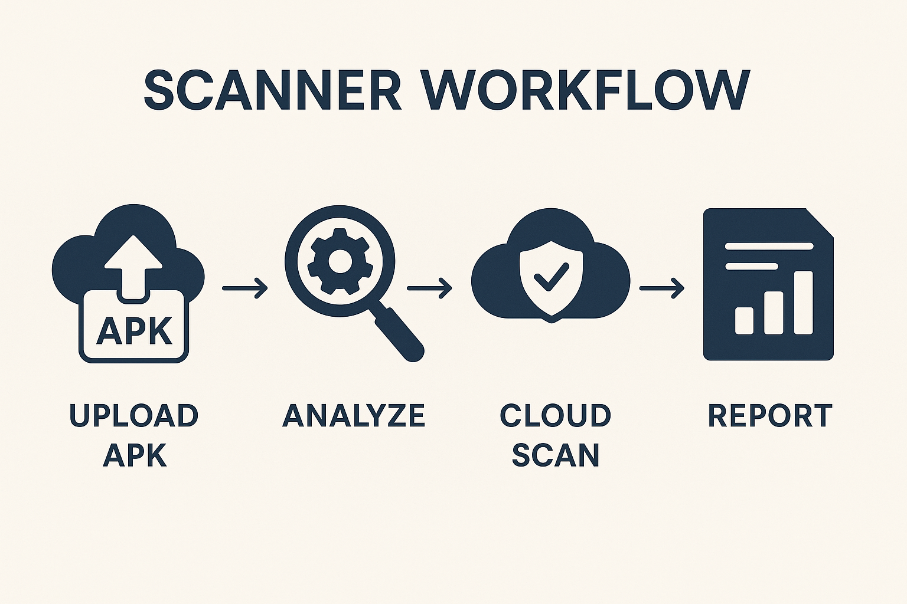

<meta name="google-site-verification" content="86dwaRY3TVSC9ozrBhENBhorbwBg5t7CJlUbJ9XN6ws" />
# How a Public-Facing Bucket Led to One of the Largest Mobile App Data Leaks — and How to Prevent It

*Posted on August 29, 2025 by APK Leak Scanner Team*  

---

  <!-- Left column: text -->
  

    
<strong>TL;DR:</strong> A single misconfigured Firebase bucket in a popular tea delivery app exposed thousands of users' private details to the public internet. Within days, malicious actors exploited the data to doxx victims across social platforms.

    
Our <strong>APK Leak Scanner</strong> was built to prevent exactly this kind of disaster.

  

  <!-- Right column: image -->
  

    
  

---

## ☕ The Tea App Leak: What Went Wrong?

Earlier this year, security researchers discovered that a **tea delivery app**, downloaded by millions of users, had left its **Firebase storage bucket wide open**.  

That meant:  

- No authentication was required  
- Anyone with a browser could list files  
- Sensitive data (phone numbers, order history, even GPS delivery routes) was sitting publicly on the internet  

  <!-- Left column: image -->
  

    
  

  <!-- Right column: text -->
  

    
Once attackers noticed, the exploitation was swift:

    <ul>
      <li>The bucket was scraped using automated tools</li>
      <li>Personal details were aggregated</li>
      <li>Thousands of innocent users were <strong>doxxed</strong> on forums and Telegram groups</li>
    </ul>
    
The <strong>root cause</strong> wasn’t a zero-day. It wasn’t a sophisticated hack.

    
It was a <strong>simple misconfiguration</strong> that no one caught.

  

---

## 🔍 Why This Matters for Developers

Today’s apps don’t just live on phones. They are tightly coupled with **cloud services**:  

- Firebase  
- AWS S3  
- GCP Buckets  
- Azure Storage  
- Dozens of other backends  

When developers hardcode cloud service IDs, API keys, or expose unauthenticated storage, the entire **userbase is put at risk**.  

The Tea App incident is just one of many. It could happen to anyone rushing to push code to production without a final security scan.

---

## 🛡️ How APK Leak Scanner Prevents These Issues

  

    <strong>THAT'S WHERE OUR TOOL COMES IN!</strong>
  

  

  

    <strong>APK Leak Scanner</strong> is a lightweight static analysis tool that:
  

  <ul style="margin-left:20px; text-align:left;">
    <li>✅ <strong>Scans Android APKs</strong> for embedded cloud service configurations (Firebase, AWS, Azure, GCP, etc.)</li>
    <li>✅ <strong>Detects public-facing buckets</strong> and warns you before attackers do</li>
    <li>✅ <strong>Flags hardcoded secrets, tokens, and API keys</strong></li>
    <li>✅ <strong>Analyzes permissions and exported components</strong> for potential abuse</li>
    <li>✅ <strong>Generates professional reports</strong> in HTML format for display right in the site</li>
  </ul>

  

    Our scanner doesn’t replace a full pentest or enterprise-grade suite — but it fills the <strong>critical blind spot</strong> that allowed the Tea App disaster to happen.
  

  

 

---

## 📈 Why Security-Minded Developers Love This

- **Fast:** Upload your APK and get results in minutes  
- **Transparent:** Clear reports with remediation advice  
- **Focused:** Finds what *actually* leaks, not just noise  
- **Free:** Yes, we said FREE!  

By integrating this tool into your CI/CD pipeline, you can **stop a leak before it ever hits production**.

---

## ⚖️ A Note on Responsibility

We built APK Leak Scanner to empower **responsible developers** and **security teams**.  

- 🚫 Do **not** use it to target apps you don’t own or have explicit permission to test  
- ✅ Do use it as part of your **defensive security practice**  

We believe better tools in the hands of developers mean fewer headlines like the Tea App breach.

---

## 🔗 Get Started

- [View on GitHub](https://github.com/yourusername/apkleakscanner)  
- [Try it now!](https://freeonlineapkleakscanner.com)  

---

*Security isn’t about paranoia. It’s about prevention. The Tea App leak didn’t have to happen. With the right tools, the next one won’t.*  

